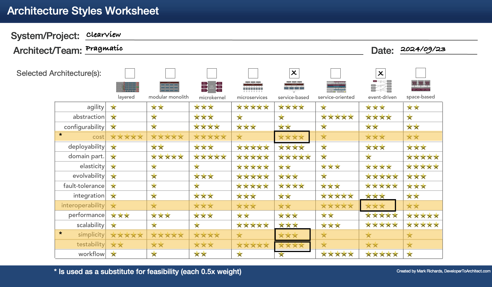

# ADR-002: Architecture style

## Date:

2024-09-23

## Status:

Accepted

## Context:

The style of the architecture is the cornerstone of a succesfull software project. Depending on the style, additional
decisions like databases, communication patterns, ... can be derived.

Needs [ADR-004](/ADR/ADR-004-data-integrity-downplayed.md) for the decision.

## Decision:

According to the requirements and the [Architecture Characteristics](../ArchitectureCharacteristics/Characteristics.md) we
decided to use the Service Based Architecture. Where needed for better inteoperability and deployability we want to use
Eventdriven Architecture.

Although the microkernel architecture was considered, its limitations in scalability and fault-tolerance two of our
top [7 driving characteristics](../ArchitectureCharacteristics/Characteristics.md) led us to pursue a different option.

TODO: James

## Consequences:

- Service-Based Architecture is comparatively cheaper and faster to build and easier to maintain
- Event streaming adds complexity, but enables additional decoupling of capabilities
