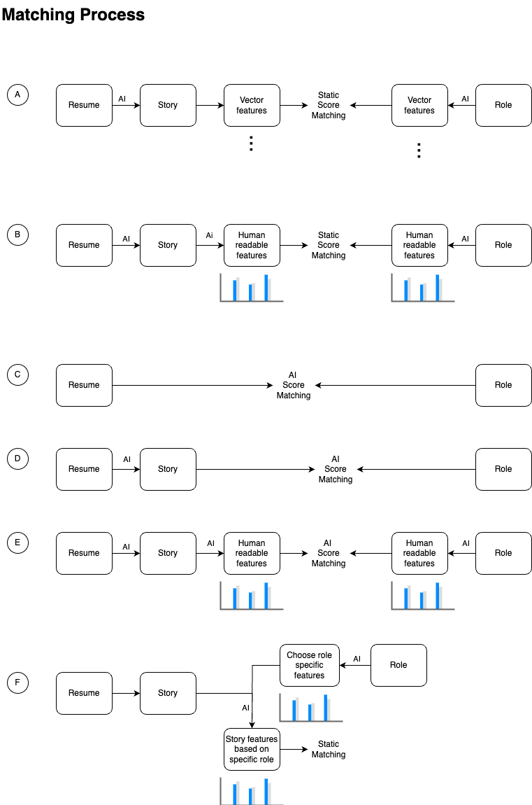

# ADR-011: Deterministic matching

## Date:

2024-09-26

## Status:

Accepted

## Context:

The matching algorithm has a big influence on cost and architectural design.
Making a decision about the nature of scoring and matching helps to access
cost and performance.

We defined:

TODO: Add to glossary!

- Resume: PDF as uploaded by user
- Story: Anonymized format of the resume as text, void of information that could lead to unfair discrimination.
- Features: Quantified distribution of personal skills, traits, experience across principal components. Not human
  comprehensible.
- Spyder: Quantified distribution of personal skills, traits, experience across predefined axes. Human comprehensible.
- Score: The result of comparing an open job with a representation of a resume.

We considered several matching processes for candidates and roles. Some of these processes utilized vector-based features
that are highly effective for AI but unreadable by humans. The decision was made to use human-readable features to
maintain better control over the AI and improve interpretability.

The options we considered were:

- **A) Extracting features from both the role and the story, then performing a static match.
- **B) Using features extracted by AI but made static and understandable by humans.
- **C) Letting AI directly match resumes and roles, but this was discarded due to bias concerns.
- **D) Allowing AI to assess whether a story and role should match.
- **E) Matching stories and roles using human-readable features and calculating a match score.
- **F) Each role has its own features, and candidates are evaluated based on these, but this approach was too
  resource-intensive.

We tested them against several criteria:
- A critical requirement is Q14, which, due to the non-deterministic nature of AI training, we can
only solve through exhaustive testing.
- The asymptotic complexity with respect to number of AI-prompts of comparing resumes with open roles is linear, O(n+m), for A and B, 
but quadratic for all others.
- The asymptotic complexity with respect to the number of AI-prompts due to update operations (needed for Q15) on a resume or open role is
  significantly better for option B and A.
- The asymptotic complexity is only relevant, if a large amount of open roles should be considered for a resume.
However, if the number of open roles to be considered are reduced beforehand, f.ex. by input of the candidate,
utilization and cost may drop significantly.

## Decision:

We decided to proceed with Option B, where human-readable features extracted by AI are made static. This provides an
ideal balance between transparency, testability, and resource efficiency. 

While we considered Option F, which involves role-specific features and a static evaluation of all candidates, we
ultimately ruled it out because it would be too computationally expensive. Although this option would have provided
precise and detailed evaluations, the resource demands and expected cost made it impractical for our current setup.

By selecting Option B, we maintain transparency and control without sacrificing performance or requiring excessive
computational power.

## Consequences:

- **Transparency**: The human-readable features ensure transparency, making it easier to validate and interpret the AI’s
  decision-making process.
- **Control**: This approach allows for better human oversight over the AI’s matching process.
- **Resource Efficiency**: It only has linear asymptotic complexity with respect to the number of prompts
as opposed to purely AI-driven or complex vector-based methods,
  making it more suitable for our needs.

### Strengthened characteristics:

- Testability (intermediate representation (spyder) allows for smaller, more precise tests)
- Feasibility (more comprehensible, verifiable process)
- Cost (significantly fewer AI-prompts)
- Deployability (due to testability)
- Data integrity (easier to verify, less AI)
- Performance

### Weakened characteristics:
