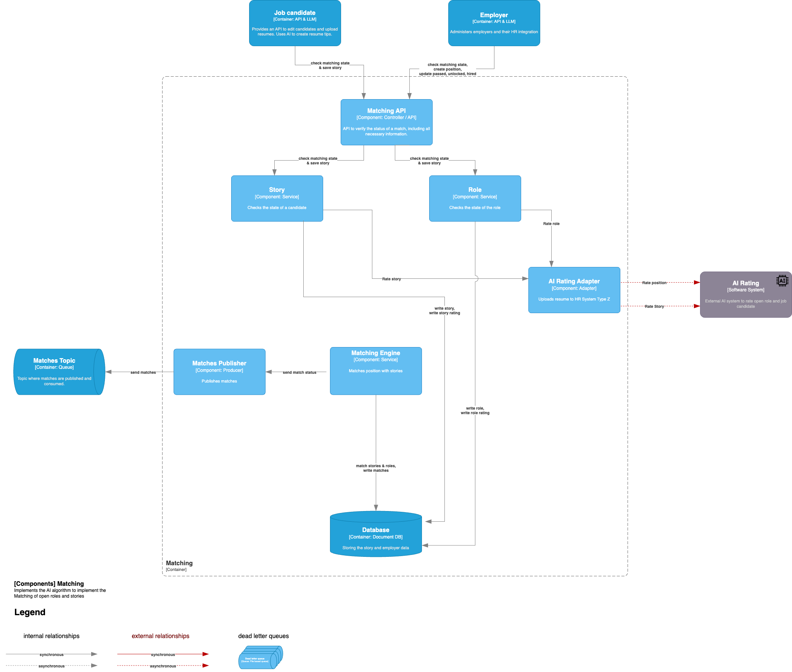

# Components Diagram (C3) - Matching System

In this C3 diagram, we explain how different components within the **Matching System** interact. 
The system manages saving stories and roles, extracting AI-based features, and generating matches between them. 
Due to the large size of the UI, it is not represented in this data flow. 
However, all interactions by **Job Candidates** and **Employers** happen through the UI, 
which communicates with the **Matching API**.

### Matching System Overview

The **Matching System** orchestrates the extraction of features from stories and roles, the scoring of pairs of job
positions and resumes, and the determination of matches. 
It uses asynchronous processes, AI feature extraction, and periodic checks for new or unmatched stories and roles.

- **Deterministic Scoring**  
  AI should only be used for feature extraction and not for the scoring and matching itself, 
as described in [ADR-011: Deterministic Matching](/ADR/ADR-011-deterministic-matching.md).

## Data Flow

### Reading the Match Status

1. **Job Candidate** or **Employer** requests the match status via the **Matching API**.
2. The **Matching API** retrieves the match status from the **Match Service**.
3. The **Match Service** reads the relevant data from the **Shared Database**.
4. The **Matching API** sends the result back to the **Job Candidate** or **Employer**.

### Updating the Match State

1. **Job Candidate** or **Employer** submits an update request for a match state via the **Matching API**.
2. The **Matching API** forwards the request to the **Match Service**.
3. The **Match Service** writes the updated state to the **Shared Database**.
4. A confirmation is sent back through the **Matching API** to the **Job Candidate** or **Employer**.

### Periodic Feature Extraction

1. The **Feature Extractor** periodically checks the **Shared Database** for pairs of **open roles** and **stories** without a score.
2. The **Feature Extractor** sends the unrated stories or roles to the **AI Feature Extraction Adapter** (asynchronously).
3. The **AI Feature Extraction Adapter** forwards the request to the **AI Feature Extraction** service (external, asynchronous).
4. The **AI Feature Extraction** service processes the story or role and sends the extracted features back to the **AI Feature Extraction Adapter**.
5. The **AI Feature Extraction Adapter** forwards the features to the **Feature Extractor**, which writes them to the **Shared Database**.

### Match Creation Process

1. The **Match Creator** periodically checks the **Shared Database** for combinations of **open roles** and **stories** that haven't been evaluated.
2. The **Match Creator** analyzes the combinations and searches for potential matches.
3. If a match is found, the **Matches Publisher** is notified.
4. The **Matches Publisher** sends the match information to the **Match Topic Queue** for further processing.
